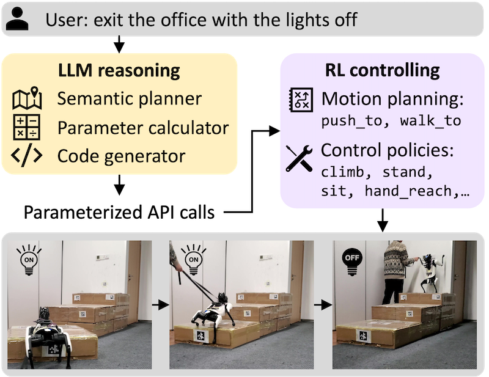

# Long-horizon Locomotion and Manipulation on a Quadrupedal Robot with Large Language Models




The full prompts and codes are coming soon.
Website: https://sites.google.com/view/long-horizon-robot

## 🔍 Introduction

We present a system that empowers quadruped robots with high-level problem-solving capabilities for long-horizon tasks. These tasks go far beyond short-term motions, requiring both semantic-level reasoning and a diverse set of low-level locomotion and manipulation skills.

This repository provides the simulation environment built on Isaac Gym, where long-horizon tasks can be tested and developed.
Sorry about that —due to licensing and permission limitations, we are unable to release the Xiaomi cyberdog2’s URDF files and the full code.

This repository contains the official implementation of our paper:

> **Long-horizon Locomotion and Manipulation on a Quadrupedal Robot with Large Language Models**  
> Yutao Ouyang, Jinhan Li, Yunfei Li, Zhongyu Li, Chao Yu, Koushil Sreenath, Yi Wu
> IROS, 2025  
> [arXiv](https://arxiv.org/abs/2404.05291)

A live demo or project website is available at:  
🔗 **[https://sites.google.com/view/long-horizon-robot](https://sites.google.com/view/long-horizon-robot)**

## 🛠️ Installation

We recommend using a virtual environment (e.g., `conda` or `venv`).  
Clone the repository and install dependencies:

```bash
git clone https://github.com/shihusi/LongHorizonRobot
```

1. Create a new Python virtual env or conda environment with Python 3.6, 3.7, or 3.8 (3.8 recommended)
2. Install Isaac Gym
   - Download and install Isaac Gym Preview 4 (I didn't test the history version) from https://developer.nvidia.com/isaac-gym
   - `cd isaacgym/python && pip install -e .`
   - Try running an example `cd examples && python 1080_balls_of_solitude.py`
   - For troubleshooting check docs `isaacgym/docs/index.html`
   - We tested on `pytorch 2.4.1`
3. Install rsl_rl (PPO implementation)
   - Using the command to direct to the root path of this repository
   - `cd rsl_rl && pip install -e .` 
4. Install legged_gym
   - `cd ../legged_gym && pip install -e .`
5. (Optional)
   - `pip install openai` 

## 🚀 Usage

1. Play the demo
```bash
cd LongHorizonRobot/legged_gym
python legged_gym/scripts/play.py --task c2_long_light --headless
```

2. Generate the plan
```bash
cd llm_plan_generation
python generate_long_horizon.py --envs light --main
```


📁 Project Structure

LongHorizonRobot/
├── legged_gym/          
├── llm_plan_generation/         
└── README.md

📣 Acknowledgements

We would like to thank the projects that inspired or supported this work:
	•	[Learning Agile Bipedal Motions on a Quadrupedal Robot](https://sites.google.com/view/bipedal-motions-quadruped)
	•	[Robot Parkour Learning](https://robot-parkour.github.io/)

📖 Citation

If you find this work useful, please consider citing:

@article{ouyang2024long,
  title={Long-horizon locomotion and manipulation on a quadrupedal robot with large language models},
  author={Ouyang, Yutao and Li, Jinhan and Li, Yunfei and Li, Zhongyu and Yu, Chao and Sreenath, Koushil and Wu, Yi},
  journal={arXiv preprint arXiv:2404.05291},
  year={2024}
}

📬 Contact

For questions or suggestions, feel free to contact:
	•	[oyyt](oyyttyyo@outlook.com)


